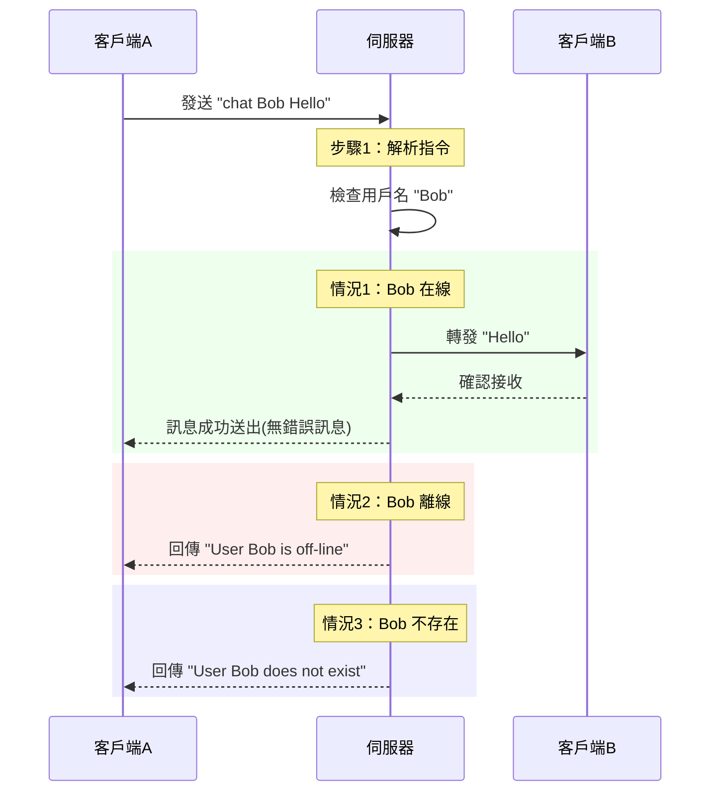

# 即時聊天系統 - 作業實作說明
基於 C 語言和 Pthreads 實現的即時聊天系統，包含了簡單的客戶端和伺服器通訊邏輯。

## 📂 檔案結構
```
├── server.h - 定義shared resources
├── server.c - 伺服器主程式與連線處理
├── client.c - 客戶端與伺服器互動
├── pthread_implement.c - 客戶端thread邏輯實現
└── makefile
```

---
## 🧠 核心邏輯

### 1. 伺服器架構
1. **Socket 初始化**  
   - 建立 TCP Socket 並綁定指定 Port
2. **連線接收**  
   - 使用 `accept()` 接受新客戶端連線
3. **Thread 管理**  
   - 每條連線建立獨立 pthread 處理
   - 使用 `pthread_detach` 分離不同的 Threads

### 2. 客戶端連線處理
客戶端首先輸入 `connect` 指令與伺服器建立連線，接著會輸入 `chat` 指令來傳送訊息。伺服器會根據客戶端的指令解析並進行處理。


### 3. 訊息傳遞流程
當客戶端傳送訊息時，伺服器會將訊息轉發給目標使用者。如果目標使用者線上，訊息會被成功發送並寫入 whiteboard；如果目標使用者離線或不存在，伺服器會回傳相應的錯誤訊息。

---
## 🛠️ 如何運行
1. 編譯程式
   - 在終端機中運行以下命令編譯伺服器與客戶端：
    ```bash
    make
2. 啟動伺服器
   - 執行伺服器程式：
   ```bash
   ./server
3. 啟動客戶端
   - 開啟另一個終端機視窗，並執行客戶端程式：
   ```bash
   ./client
4. 使用說明
- 客戶端啟動後，可以使用以下指令與伺服器互動：
    - `connect <server_ip> <port> <username>` : 連接到伺服器並註冊使用者名稱。
    - `chat <receiver> "<message>"` : 向指定使用者發送訊息。
    - `bye` : 中斷與伺服器的連線。
5. 清理
    - 若要清理編譯生成的檔案，執行以下命令：
    ```bash
    make clean
    ```
---
## 💡 設計思路
1. Multithreads：伺服器為每一個連線的客戶端創建一個獨立的Thread來處理訊息的接收和轉發，並以`serving_client()`實現細部邏輯，確保伺服器能夠同時處理多個客戶端的請求。

2. 訊息處理：伺服器接收到的每條訊息會根據預定義的指令格式進行處理，並將訊息轉發給目標用戶，若目標用戶離線或不存在，則返回錯誤訊息並不執行寫入白板。目標用戶則會在創立一個 Thread 來接收伺服器傳送的訊息。

3. 使用共享資源(變數)：伺服器中有一些共享資源（如`client_socket[MAX_client]`、`char whiteboard[MAX_size`等），因此再存取這些資源時使用了 Mutex 來防止多個 Thread 同時讀寫共享資源。
